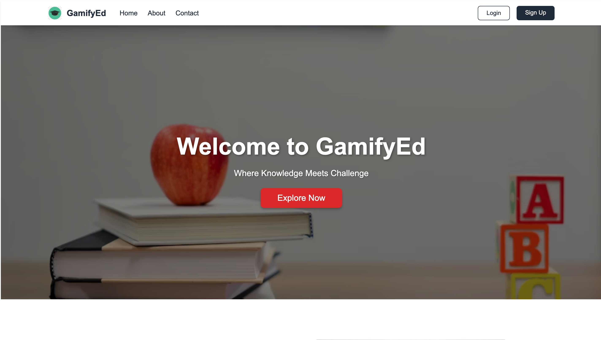
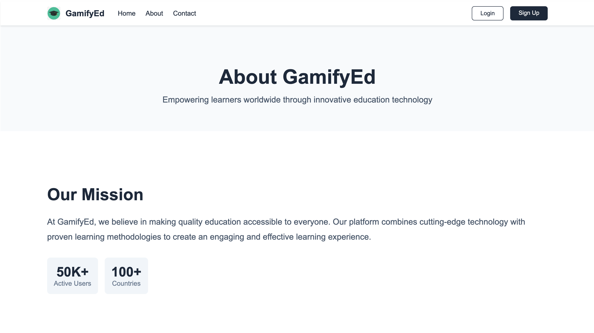
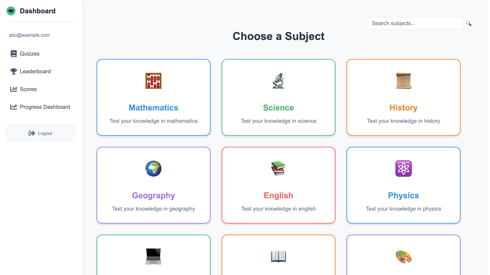
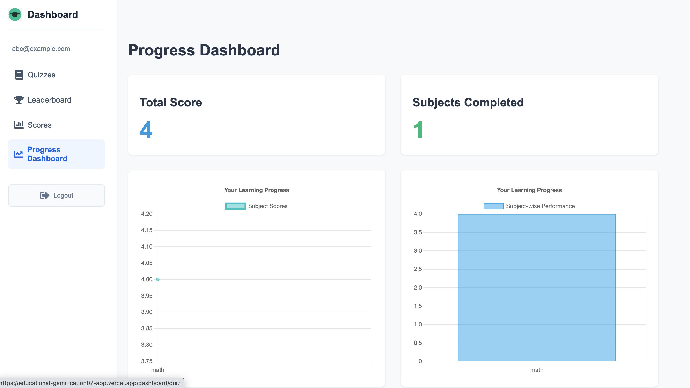
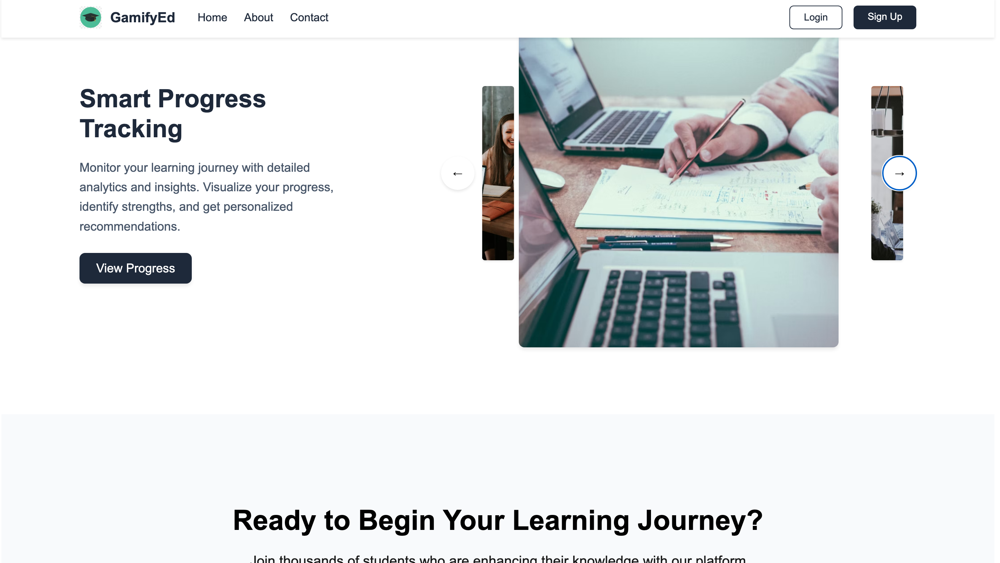

# GamifyEd

## Introduction
GamifyEd is a modern, interactive educational platform that transforms learning into an engaging game-like experience. The platform combines gamification elements, interactive learning modules, and a user-friendly interface to create an effective and fun learning environment. It solves the problem of traditional learning platforms by offering a more engaging and rewarding way to acquire knowledge through game mechanics and progress tracking.

## Project Type
Fullstack

## Deployed App
Frontend: [\[Educational-Gamification-App\]](https://educational-gamification07-app.vercel.app/)

## Directory Structure
```
my-react-app/
├─ public/              # Static assets
├─ src/                 # Source code
│  ├─ components/       # Reusable UI components
│  ├─ context/          # React context providers
│  ├─ pages/            # Page components
│  ├─ App.jsx           # Main application component
│  └─ main.jsx          # Application entry point
├─ package.json         # Project dependencies
├─ vite.config.js       # Vite configuration
└─ eslint.config.js     # ESLint configuration
```

## Video Walkthrough
[Video walkthrough will be added here]

## Features
- **User Authentication**: Secure login and signup functionality
- **Gamified Learning**: Points, badges, and achievements system
- **Interactive Modules**: Engaging game-based learning content
- **Progress Tracking**: Real-time progress monitoring and rewards
- **Leaderboards**: Compete with other learners
- **Responsive Design**: Optimized for all device sizes
- **Modern UI**: Clean and intuitive user interface

## Screenshots






## Design Decisions & Assumptions
- **Component-Based Architecture**: Using React for modular and maintainable code
- **Context API**: For state management across components
- **Chakra UI**: For consistent and accessible UI components
- **Firebase**: For authentication and data storage
- **Responsive Design**: Mobile-first approach for better accessibility
- **Performance Optimization**: Using Vite for fast development and build times
- **Gamification Elements**: Points, badges, and leaderboards for engagement

## Installation & Getting Started
1. Clone the repository:
```bash
git clone https://github.com/shatakshisachan051/Education_app
cd my-react-app
```

2. Install dependencies:
```bash
npm install
```

3. Start the development server:
```bash
npm run dev
```

4. Open your browser and navigate to `http://localhost:5173`

## Usage
1. Create an account or log in using existing credentials
2. Start your learning journey through gamified modules
3. Earn points and achievements as you progress
4. Compete with other learners on leaderboards
5. Track your learning milestones and rewards

## Credentials
- Test User: abc@example.com
- Password: 123456

## Technology Stack
- **Frontend Framework**: React 18
- **Backend Services**: Firebase
  - Authentication
  - Firestore Database
  - Cloud Functions
  - Storage
- **Build Tool**: Vite
- **UI Library**: Chakra UI, Material UI
- **State Management**: React Context API
- **Routing**: React Router DOM
- **Charts**: Chart.js
- **Animations**: Framer Motion
- **Icons**: React Icons
- **Development Tools**:
  - ESLint for code linting
  - TypeScript for type safety
  - Vite for fast development and builds

## Backend Architecture
GamifyEd uses Firebase as its backend service, providing:
- **Authentication**: Secure user management and authentication
- **Firestore Database**: Real-time data storage for:
  - User profiles and progress
  - Learning modules and content
  - Points and achievements
  - Leaderboard data
- **Cloud Functions**: Serverless backend logic for:
  - Processing game mechanics
  - Calculating scores and achievements
  - Managing leaderboards
- **Storage**: Secure file storage for:
  - Learning materials
  - User avatars
  - Game assets
- **Hosting**: Fast and secure application deployment

## API Endpoints
The application uses Firebase services for backend operations:

### Authentication
- Sign up: `firebase.auth().createUserWithEmailAndPassword()`
- Sign in: `firebase.auth().signInWithEmailAndPassword()`
- Password reset: `firebase.auth().sendPasswordResetEmail()`

### Firestore Database
- User profiles: `/users/{userId}`
- Learning modules: `/modules/{moduleId}`
- Progress tracking: `/users/{userId}/progress`
- Achievements: `/users/{userId}/achievements`
- Leaderboards: `/leaderboards/{category}`

### Cloud Functions
- Calculate points: `calculatePoints`
- Update leaderboards: `updateLeaderboard`
- Process achievements: `processAchievements`

## Contributing
1. Fork the repository
2. Create your feature branch (`git checkout -b feature/amazing-feature`)
3. Commit your changes (`git commit -m 'Add some amazing feature'`)
4. Push to the branch (`git push origin feature/amazing-feature`)
5. Open a Pull Request


